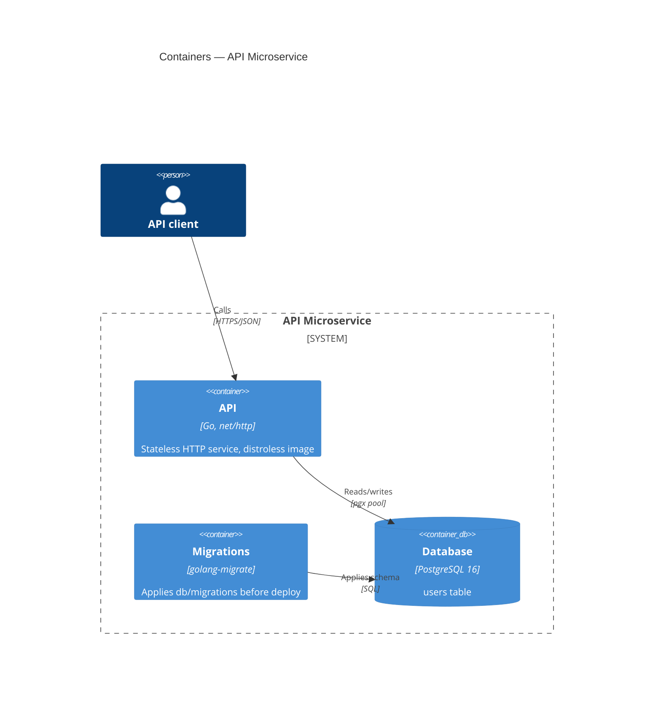

# C4 — Container diagram

> **AI-DLC phase:** `02-design`  ·  Level 2 (containers inside the system).

```mermaid
C4Container
    title Containers — API Microservice

    Person(client, "API client")

    System_Boundary(sys, "API Microservice") {
        Container(api, "API", "Go, net/http", "Stateless HTTP service, distroless image")
        Container(migrate, "Migrations", "golang-migrate", "Applies db/migrations before deploy")
        ContainerDb(db, "Database", "PostgreSQL 16", "users table")
    }

    Rel(client, api, "Calls", "HTTPS/JSON")
    Rel(api, db, "Reads/writes", "pgx pool")
    Rel(migrate, db, "Applies schema", "SQL")
```

**Notes**
- Migrations run as a separate one-off job, never from the API process (ADR-0005).
